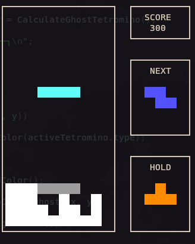
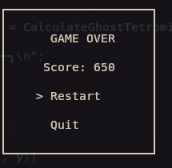
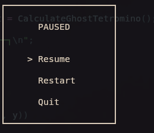

# TuiTetris

TuiTetris is a Tetris game that runs directly in the terminal. It is an
educational project created to practice modern C++, game-loop design, terminal
input handling, and text-based interface rendering without a UI framework.

## Tech Stack

- C++20
- CMake 3.20+
- POSIX APIs: `termios`, `poll`, and `unistd`
- ANSI escape sequences for terminal rendering and colors

The project is intended for Linux and other POSIX-compatible environments.

## Build and Run

Requirements:

- A compiler with C++20 support
- CMake 3.20 or newer
- A terminal with ANSI color support

Configure and build the project:

```bash
cmake -S . -B build
cmake --build build
```

Run the game:

```bash
./build/tetris
```

## License

This project is licensed under the [MIT License](LICENSE).

## Screenshots

### Gameplay



### Game Over



### Pause Menu


